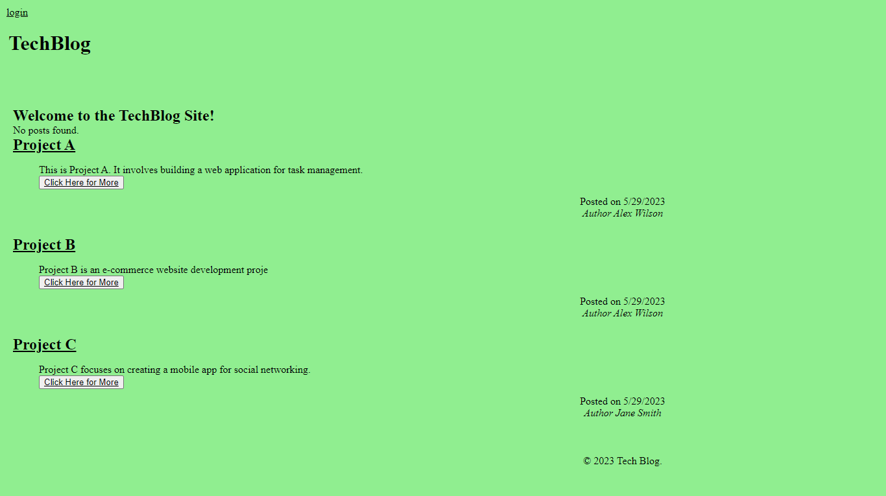

# Tech Blog

## Description
This is a CMS-style blog site similar to a Wordpress site, where developers can publish their blog posts and comment on other developers’ posts as well. 

## Installation

App uses packages: express-handlebars, mysql2sequelize, dotenv, bycrypt, express-session,connect-session-sequelize ( npm i) 

## Usage
The CMS-style blog site allows you to create, manage, and share blog posts. When you visit the site, you'll see the homepage with existing posts, navigation links, and a login option. You can navigate to the homepage or sign up/sign in. After signing up, you can log in and access the homepage, view and comment on posts. The dashboard lets you manage your posts, add new ones, and update or delete existing ones. You can also log out or be prompted to log in again after being idle for a while

 App functionality will resemble this image:

 
 
## License
N/A
## Link to github repository:
https://github.com/AnaCampos171/Techblog

## Link to deployed app:

